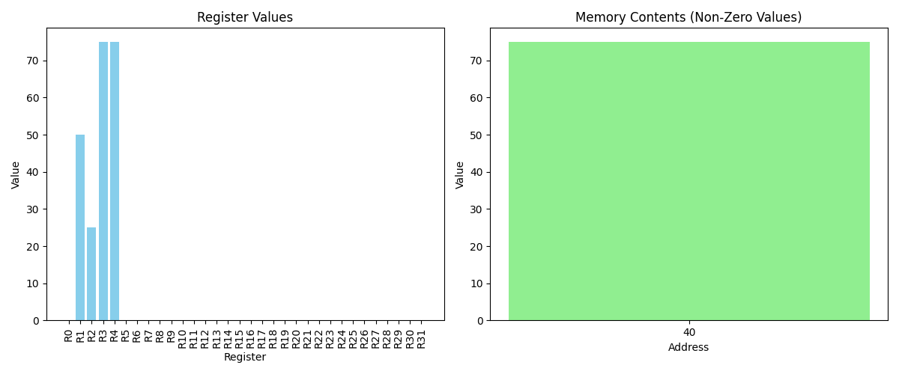

# 🧠 Python CPU Simulator

A MIPS-style CPU simulator written in Python that interprets and executes basic assembly-like instructions. It supports arithmetic, branching, memory operations, jump-and-link functionality, cache simulation, and visual output for registers and memory.

---

## 🚀 Features

- Modular CPU simulator with clear component separation:
  - `InstructionMemory`, `Memory`, `Cache`, and `CPU`
- Supports core instructions: `ADD`, `ADDI`, `SUB`, `SLT`, `BNE`, `J`, `JAL`, `LW`, `SW`, `CACHE`, `HALT`
- Label parsing for branch targets and control flow
- Instruction dispatch via dynamic dispatch table
- **Graphical output** of register and memory state using Matplotlib
- **Logging support** with timestamps and UTF-8 encoding
- Complete **test suite** to validate simulator behavior
- Exportable memory/register state for verification or teaching

---

## 📸 Demo Output



*Figure: CPU state visualized after a test run.*

---

## 📁 Project Structure

```
cpu_simulator.py        # Main simulator code
instruction_input.txt   # Instruction input file
cpu_simulator.log       # Log file with execution trace
README.md               # Project documentation
```

---

## 🛠️ Getting Started

1. **Clone the Repository**
   ```bash
   git clone https://github.com/yourusername/cpu-simulator.git
   cd cpu-simulator
   ```

2. **Run the Test Suite**
   ```bash
   python cpu_simulator.py
   ```

3. **View Graphical Output**
   Uncomment the `run_graphical_demo()` line at the bottom of the file to generate live Matplotlib charts.

---

## 🧪 Testing

This simulator includes 12+ rigorous test cases:
- Arithmetic correctness
- Branch conditions (taken and not taken)
- Unconditional and label-based jumps
- Invalid inputs and register names
- Cache operations and flush
- Memory alignment enforcement
- Looping with negative offsets

Each test logs results to both the console and a log file.

---

## 📚 Learn More

- [Full Blog Post](https://medium.com/your-blog-post-link) — Background, motivation, and walkthrough
- [Project Repository](https://github.com/yourusername/python-cpu-simulator)

---

## ✨ Acknowledgments

Built as part of my computer architecture portfolio project to deepen my understanding of instruction flow, caching, and memory interaction.

---

## 📄 License

MIT License — feel free to fork, extend, and build upon it.

---

